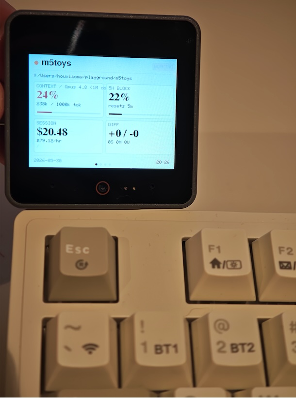

# m5stack-coding-toys

[English](README.md) | 中文

一块给 Claude Code 用的实体状态屏。它把你正在进行的 Claude Code 会话——模型、
上下文占用、花费、速率限制、git diff——实时映射到桌上的 M5Stack 设备上,让你
不切窗口就能一眼看到一次运行进行到哪了。当同时跑多个会话时,设备会变成一个可以
点选切换的列表。



## 设备上显示什么

设备会渲染若干页面,点触屏即可循环切换。

- **Overview(总览)** —— 当前使用的模型,以及一个活动状态徽章(工作中 / 该你了 /
  需要你处理),外加几个紧凑的信息块:**CONTEXT**(上下文占用百分比与 token 数)、
  **5H BLOCK**(5 小时窗口的速率限制占用与重置倒计时)、**SESSION**(本次会话的累计
  花费与燃烧速率)、**DIFF**(git 增删行数、暂存/修改文件数)。
- **Workspace / Cost / Limits** —— 同一批数据的更详细页面。
- **Sessions(会话列表)** —— 当有多个 Claude Code 会话同时存活时,选择权交给设备:
  列表列出每个会话,并标记出需要你处理的那些。点选其中一个会打开它的详情页,而不
  打断其他会话;在详情页点顶部标题即可立刻返回列表。
- **Waiting(等待屏)** —— 没有活动会话时显示:时钟与日期(通过链路同步为你主机的
  本地时间)、连接状态、电量。

## 在哪里购买

硬件由 M5Stack 生产,在官方商店出售:**[shop.m5stack.com](https://shop.m5stack.com/)**。

本项目目前支持 **M5Stack CoreS3 系列**(CoreS3 与 CoreS3 SE)。V1 在 macOS +
**CoreS3 SE** 上做过实机验证。Cardputer ADV 的固件目标可以编译,但尚未经过硬件
验证;其他平台与开发板均为尽力支持。

## 安装(macOS)

```bash
npm i -g m5ct
m5ct install        # 把状态屏接入 ~/.claude/settings.json
                    # (会备份 settings.json;并串接你已有的 statusLine)
m5ct flash          # 下载固件并烧录到已连接的 M5Stack 设备
```

后台守护进程(`m5ctd`)按需启动、空闲时退出。它是单例,并负责协调串口,因此
`m5ct flash` 能临时接管串口、用完再自动交还。`m5ct uninstall` 会还原你之前的
statusLine。

首次烧录 CoreS3 SE 时,请参考
[`docs/architecture/firmware-hardware-gotchas.md`](docs/architecture/firmware-hardware-gotchas.md)
里的上手说明——自动复位不可靠、出厂预装的 UiFlow2 固件会挡住第一次烧录、且 USB
模式有讲究。

## 工作原理

```
Claude Code  ──statusLine──▶  m5ct-statusline  ──▶  m5ctd  ──NDJSON/串口──▶  M5Stack
 (每条消息)                      (shim)         (聚合 + git 信息增强)         (渲染)
```

Claude Code 的 `statusLine` 会在每条消息时调用 `m5ct-statusline` shim。shim 把原始
JSON 转发给 `m5ctd` 守护进程;守护进程对其聚合、做信息增强(git 状态、燃烧历史)、
解析出归属的 Claude Code 进程,然后通过一套小巧的 NDJSON-over-串口 协议向设备推送
一帧整合后的 `status`。设备只是一个轻量渲染端,由三态存活状态机驱动——
**NoLink / Linked / Live**——因此当会话处于"空闲但仍存活"时它会停留在状态页,只有
会话真正结束时才回落到等待屏。

更深入的笔记(数据流、存活状态机、协议、RGB565 截屏、固件踩坑)见
[`docs/architecture/`](docs/architecture/README.md);面向贡献者与 agent 的说明见
[`AGENTS.md`](AGENTS.md)。

## 许可

MIT —— 见 [LICENSE](./LICENSE)。
